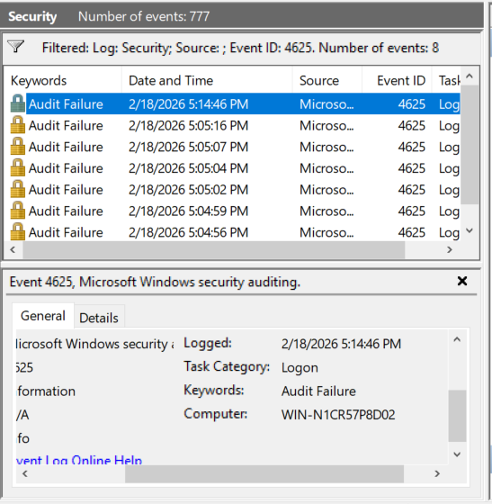
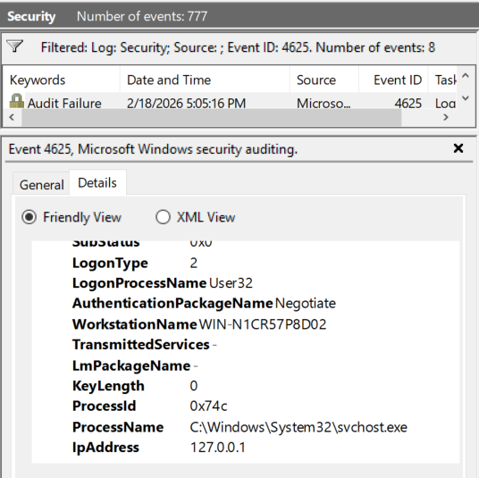

# Windows Authentication Investigation Lab

## Objective
Simulate and investigate suspicious login activity using Windows Security Event Logs.

## Lab Environment
- Windows 10 Virtual Machine
- Local test account: testuser
- Event Viewer (Security Log)

## Scenario
Multiple failed login attempts (Event ID 4625) were generated for the user "testuser", followed by a successful login (Event ID 4624).

## Investigation Steps
1. Generated multiple failed login attempts by entering incorrect password.
2. Filtered Windows Security logs for Event ID 4625 (failed logins).
3. Analyzed logon type, failure reason, and source IP address.
4. Correlated findings with Event ID 4624 (successful login).

## Key Findings
- Event ID 4625: Failed login attempts
- Logon Type: 2 (Interactive - Local login)
- Source IP: 127.0.0.1 (Localhost)
- Failure Reason: Incorrect password
- Event ID 4624 occurred shortly after failed attempts

## Assessment
The activity is consistent with a user mistyping their password during local authentication.
No evidence of remote access or brute-force attack was observed.

## Recommended Action
No escalation required.
Optional: Implement account lockout policy for repeated failed authentication attempts.

## Evidence
The following screenshots demonstrate log filtering, event analysis, and authentication pattern correlation.

### Failed Login Events (4625) 

### Event Details

### Successful Login (4624) 

